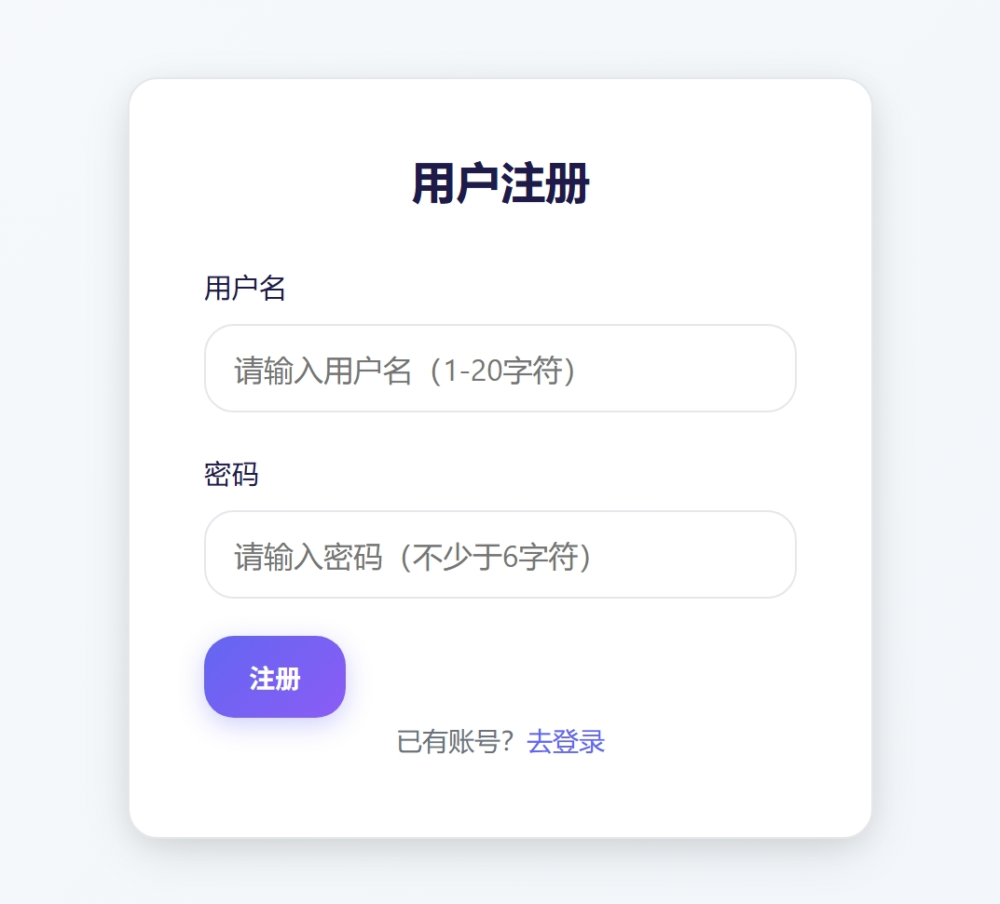

# Blog

## 项目概述：将构建一个简单前后端分离的博客，预计有以下功能：

- 文章列表展示
- 文章详情查看
- 文章发布、编辑、删除功能
- 简单的用户认证：未登录也可以查看所有博客，但只有登录了才能发布博客，且只能编辑和删除自己的博客

下面是一些相关页面的展示：

## 

---

## 

---

## 

---

## 

---

## 

---

## 

---

## 

## 技术栈：

- **前端**：Vue 3 + Vite + Vue Router（路由） + Axios（发请求）
- **后端**：Node.js + Express（Web 框架） + MongoDB（数据库） + Mongoose（操作数据库） + JWT

## 开发日志

### 第一阶段 --2025.9.22

完成了后端基础服务：

- 后端能连接 MongoDB 数据库，存储博客数据；
- 提供了第一个可用接口 GET /api/blogs，能返回博客列表；
- 项目结构模块化（路由、模型、配置分开），后续扩展方便（比如加 “创建博客”“删除博客” 接口）。

### 第二阶段 --2025.9.22

搭建前端基础框架：用 Vite 创建 Vue 3 项目，配置了路由，创建了 “博客列表页”，能正常启动并显示静态内容。

### 第三阶段 --2025.9.22

成功实现了 “前端对接后端接口” 的核心功能：

- **封装 Axios**：统一处理请求基础地址、错误，后续接口调用更简洁；
- **调用接口**：在组件中用异步函数获取后端 GET /api/blogs 数据，处理加载 / 错误状态；
- **渲染数据**：把接口返回的 JSON 数据转成用户易懂的页面，支持日期格式化、内容截取、hover 动画等细节优化。

### 第四阶段 --2025.9.22

实现了创建新博客的功能

- **后端**：新增 POST /api/blogs 接口，实现数据验证、存入数据库、返回响应的逻辑；
- **前端**：创建 “创建博客” 页面，包含表单验证、加载状态、错误提示，并用 $router 实现页面跳转；
- **用户体验**：添加 “创建博客” 按钮、动态页面标题、表单必填项标记，优化交互细节。

### 第五阶段 --2025.9.23

完成了 “博客详情页” 的核心功能：

- **后端**：新增 GET /api/blogs/:id 接口，支持按 ID 查询单篇博客，完善错误处理；
- **前端**：创建详情页组件，通过路由参数获取 ID 并调用接口，展示完整内容；
- **用户体验**：实现标题点击跳转、详情页返回按钮、时间格式化（精确到分钟）、内容换行保留等细节。

### 第六阶段 --2025.9.29

完成了 “编辑博客” 功能：

- **后端**：新增 PUT /api/blogs/:id 接口，支持按 ID 更新博客，启用数据验证；
- **前端**：创建编辑页组件，复用表单结构，实现原数据回显和更新提交逻辑；
- **用户体验**：在详情页添加编辑入口，更新后自动跳转回详情页，保持操作连贯性。

### 第七阶段 --2025.9.29

完成了 “删除博客” 功能：

- **后端**：新增 DELETE /api/blogs/:id 接口，支持按 ID 删除博客，完善错误处理；
- **前端**：在详情页添加删除按钮和确认弹窗，实现删除逻辑和加载状态管理；
- **用户体验**：通过确认弹窗防止误操作，删除后自动跳转并提示，确保操作流程清晰。

### 第八阶段 --2025.10.9

完成了完整的用户认证系统：

- **后端**：实现用户注册（密码加密）、登录（生成 Token）、权限中间件（验证 Token），并关联博客作者身份；
- **前端**：开发登录 / 注册页面，存储 Token 并自动携带，根据登录状态控制路由访问和按钮显示；
- **核心效果**：只有登录用户能创建博客，且只能编辑 / 删除自己的博客，未登录用户被限制访问敏感接口。

### 第九阶段 --2025.10.10

完成了分页功能的完整实现：

- **后端**：改造列表接口，支持接收分页参数，通过 skip() 和 limit() 实现数据截取，返回总条数和总页数；
- **前端**：添加分页组件，实现页码切换、状态控制（禁用 / 高亮），优化用户交互（滚动到顶部、分页信息展示）；
- **核心价值**：解决大量数据加载慢的问题，提升页面性能和用户体验，是中后台系统和内容列表的必备功能。

### 第十阶段 --2025.10.13

通过这次修改，我们实现了：

- **作者信息自动关联**：创建博客时不再需要手动输入作者，自动使用当前登录用户的用户名；
- **数据安全性提升**：作者信息由后端从 Token 解析生成，避免前端伪造作者身份；
- **查看个人发布的博客**：作者登陆后可以查看自己发布过的博客；
- **逻辑简化**：减少用户输入步骤，提升操作体验。
  该阶段开发遇到的问题：
  问题：向后端个人主页 url：/api/blogs/my-blogs 发送请求时出错，页面提示博客 ID 格式错误；  
  原因：显然这是接口/api/blogs/:id 的错误提示信息，说明在向/api/blogs/my-blogs 发送请求，其实是在向
  /api/blogs/:id 发送请求，my-blogs 被当成了 id 参数，导致接口/api/blogs/my-blogs 不起效果，发现在 blogRoutes.js
  文件，接口/api/blogs/my-blogs 的路由设置反而在/api/blogs/:id 之下，导致 api/blogs/my-blogs 一直没起效
  解决：将动态路由/api/blogs/:id 放在静态路由 api/blogs/my-blogs 下就可以了；

### 第十一阶段 --2025.10.13

通过 “路由参数传递来源标识 + 动态渲染按钮” 的方式，实现了：

- 不同入口进入详情页时，显示对应的返回按钮；
- 保持了页面间跳转的连贯性，提升用户体验；
- 兼容了无参数的访问场景，避免功能异常

### 第十二阶段 --2025.10.15

完成了**全局样式统一**和**视图重构**：

- **全局样式**：定义了统一的配色、按钮、卡片、导航栏样式，确保所有页面风格一致，且具有 “华丽现代” 的视觉效果；
- **视图重构**：基于全局样式重构模板和样式，解决了之前的视图单调的问题，同时优化了交互体验（如标题 hover 变色、分页按钮状态控制）；
- **响应式适配**：确保在手机、电脑等不同屏幕上都能正常显示，提升多设备兼容性。

第十二阶段 --2025.10.15
完成了**富文本编辑器集成**和核心功能适配：
- **编辑器基础集成**：从依赖安装、本地资源配置到组件封装，解决了 TinyMCE 6.x 强制 API Key、资源加载 404、变量未定义等系列报错，最终实现 5.10.7 版本稳定运行；
- **核心编辑功能实现**：支持文字格式（加粗 / 斜体）、列表（有序 / 无序）、链接插入、图片本地预览，以及中文语言包适配，工具栏和交互逻辑符合博客编辑场景；
- **前后端衔接适配**：完成编辑器内容与前端表单的双向绑定，确保编辑内容能同步到发布 / 编辑页面的提交数据中，为后续对接后端图片存储和数据库打好基础。
