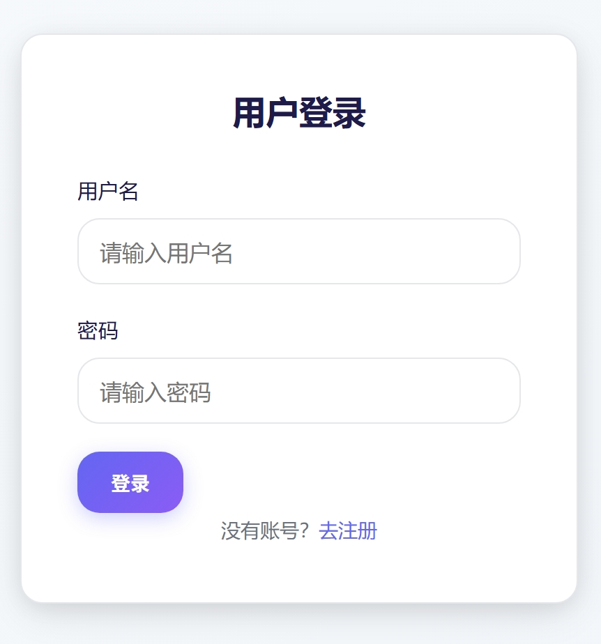
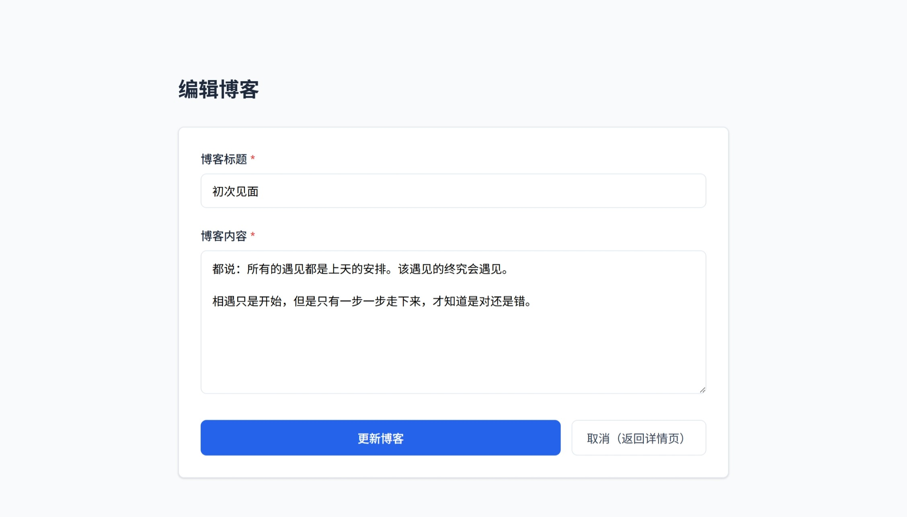
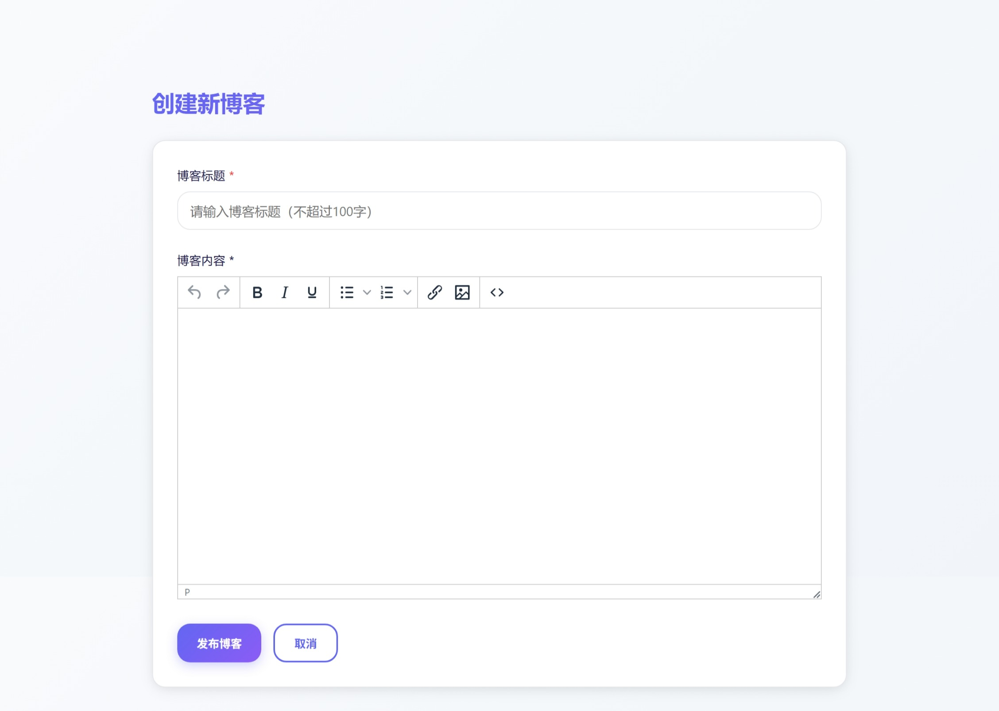

# Blog

## 项目概述：将构建一个简单前后端分离的博客，预计有以下功能：

- 文章列表展示
- 文章详情查看
- 文章发布、编辑、删除功能
- 简单的用户认证：未登录也可以查看所有博客，但只有登录了才能发布博客，且只能编辑和删除自己的博客

下面是一些相关页面的展示：

---

---

---

---

---

---

---

## 技术栈：

- **前端**：Vue 3 + Vite + Vue Router（路由） + Axios（发请求）
- **后端**：Node.js + Express（Web 框架） + MongoDB（数据库） + Mongoose（操作数据库） + JWT

## 开发日志

### 第一阶段 --2025.9.22

完成了后端基础服务：

- 后端能连接 MongoDB 数据库，存储博客数据；
- 提供了第一个可用接口 GET /api/blogs，能返回博客列表；
- 项目结构模块化（路由、模型、配置分开），后续扩展方便（比如加 “创建博客”“删除博客” 接口）。

### 第二阶段 --2025.9.22

搭建前端基础框架：用 Vite 创建 Vue 3 项目，配置了路由，创建了 “博客列表页”，能正常启动并显示静态内容。

### 第三阶段 --2025.9.22

成功实现了 “前端对接后端接口” 的核心功能：

- **封装 Axios**：统一处理请求基础地址、错误，后续接口调用更简洁；
- **调用接口**：在组件中用异步函数获取后端 GET /api/blogs 数据，处理加载 / 错误状态；
- **渲染数据**：把接口返回的 JSON 数据转成用户易懂的页面，支持日期格式化、内容截取、hover 动画等细节优化。

### 第四阶段 --2025.9.22

实现了创建新博客的功能

- **后端**：新增 POST /api/blogs 接口，实现数据验证、存入数据库、返回响应的逻辑；
- **前端**：创建 “创建博客” 页面，包含表单验证、加载状态、错误提示，并用 $router 实现页面跳转；
- **用户体验**：添加 “创建博客” 按钮、动态页面标题、表单必填项标记，优化交互细节。

### 第五阶段 --2025.9.23

完成了 “博客详情页” 的核心功能：

- **后端**：新增 GET /api/blogs/:id 接口，支持按 ID 查询单篇博客，完善错误处理；
- **前端**：创建详情页组件，通过路由参数获取 ID 并调用接口，展示完整内容；
- **用户体验**：实现标题点击跳转、详情页返回按钮、时间格式化（精确到分钟）、内容换行保留等细节。

### 第六阶段 --2025.9.29

完成了 “编辑博客” 功能：

- **后端**：新增 PUT /api/blogs/:id 接口，支持按 ID 更新博客，启用数据验证；
- **前端**：创建编辑页组件，复用表单结构，实现原数据回显和更新提交逻辑；
- **用户体验**：在详情页添加编辑入口，更新后自动跳转回详情页，保持操作连贯性。

### 第七阶段 --2025.9.29

完成了 “删除博客” 功能：

- **后端**：新增 DELETE /api/blogs/:id 接口，支持按 ID 删除博客，完善错误处理；
- **前端**：在详情页添加删除按钮和确认弹窗，实现删除逻辑和加载状态管理；
- **用户体验**：通过确认弹窗防止误操作，删除后自动跳转并提示，确保操作流程清晰。

### 第八阶段 --2025.10.9

完成了完整的用户认证系统：

- **后端**：实现用户注册（密码加密）、登录（生成 Token）、权限中间件（验证 Token），并关联博客作者身份；
- **前端**：开发登录 / 注册页面，存储 Token 并自动携带，根据登录状态控制路由访问和按钮显示；
- **核心效果**：只有登录用户能创建博客，且只能编辑 / 删除自己的博客，未登录用户被限制访问敏感接口。

### 第九阶段 --2025.10.10

完成了分页功能的完整实现：
- **后端**：改造列表接口，支持接收分页参数，通过 skip() 和 limit() 实现数据截取，返回总条数和总页数；
- **前端**：添加分页组件，实现页码切换、状态控制（禁用 / 高亮），优化用户交互（滚动到顶部、分页信息展示）；
- **核心价值**：解决大量数据加载慢的问题，提升页面性能和用户体验，是中后台系统和内容列表的必备功能。